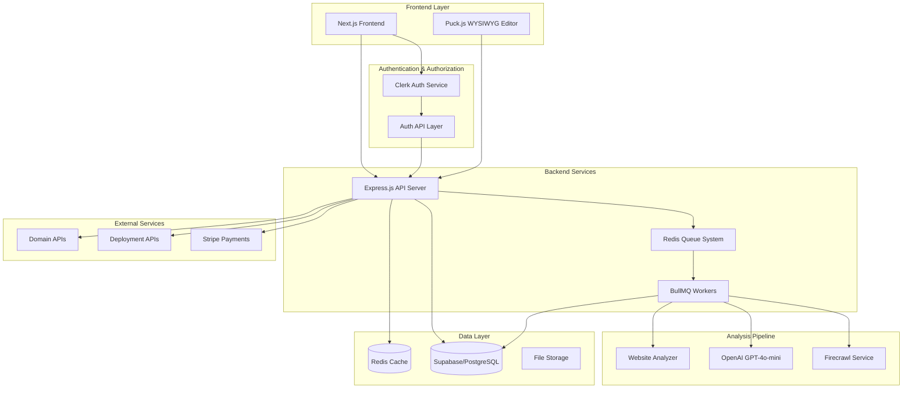

# Design Document

## Overview

The Website Improvement SaaS platform is designed as a modern web application that leverages AI-powered analysis to help small business owners improve their websites. The system integrates with the existing Firecrawl infrastructure for web crawling and analysis, while adding new capabilities for guided editing, credit management, and deployment automation.

The architecture follows a microservices approach with clear separation between the frontend application, backend API services, analysis pipeline, and deployment services. The system is designed for scalability, reliability, and optimal user experience.

## Architecture

### High-Level Architecture



### Service Architecture

The system is composed of several key services:

1. **Frontend Application**: Next.js with App Router for the user interface
2. **API Gateway**: Express.js server handling all client requests
3. **Analysis Pipeline**: Background workers processing website analysis
4. **Authentication Service**: Clerk integration for user management
5. **Payment Service**: Stripe integration for credit and subscription management
6. **Deployment Service**: Integration with Vercel/Netlify/Render APIs
7. **Domain Service**: Integration with domain registrar APIs

## Components and Interfaces

### Frontend Components

#### Authentication Component
- **Purpose**: Handle user signup, login, and session management
- **Technology**: Clerk React components
- **Interface**: 
  - `signUp()`: Create new user account
  - `signIn()`: Authenticate existing user
  - `signOut()`: End user session
  - `getUser()`: Retrieve current user data

#### URL Input Component
- **Purpose**: Capture and validate website URLs for analysis
- **Technology**: React with Zod validation
- **Interface**:
  - `validateUrl(url: string): boolean`
  - `submitUrl(url: string): Promise<AnalysisJob>`
  - `onAnalysisStart(callback: Function)`

#### Preview Component
- **Purpose**: Display side-by-side comparison of original and improved websites
- **Technology**: React with iframe integration
- **Interface**:
  - `renderOriginal(url: string): JSX.Element`
  - `renderImproved(improvements: Improvement[]): JSX.Element`
  - `highlightChanges(changes: Change[]): void`

#### Editor Component
- **Purpose**: Provide WYSIWYG editing capabilities
- **Technology**: Puck.js or GrapesJS integration
- **Interface**:
  - `initializeEditor(content: string): Editor`
  - `saveChanges(): Promise<void>`
  - `exportCode(): string`
  - `applyTemplate(template: Template): void`

#### Credit Counter Component
- **Purpose**: Display and manage user credit consumption
- **Technology**: React with real-time updates
- **Interface**:
  - `getCurrentCredits(): number`
  - `deductCredits(amount: number): Promise<void>`
  - `showUpgradePrompt(): void`

### Backend API Interfaces

#### Analysis API
```typescript
interface AnalysisAPI {
  // Start website analysis
  POST /api/v1/analyze
  body: { url: string, userId: string }
  response: { jobId: string, status: 'queued' }
  
  // Get analysis status
  GET /api/v1/analyze/:jobId
  response: { 
    status: 'queued' | 'processing' | 'completed' | 'failed',
    progress?: number,
    result?: AnalysisResult
  }
  
  // Get analysis results
  GET /api/v1/analyze/:jobId/results
  response: AnalysisResult
}

interface AnalysisResult {
  originalSite: SiteData;
  improvements: Improvement[];
  seoScore: number;
  performanceScore: number;
  accessibilityScore: number;
  uxScore: number;
}
```

#### Project API
```typescript
interface ProjectAPI {
  // Create new project
  POST /api/v1/projects
  body: { name: string, url: string, analysisId: string }
  response: Project
  
  // Get user projects
  GET /api/v1/projects
  response: Project[]
  
  // Update project
  PUT /api/v1/projects/:id
  body: Partial<Project>
  response: Project
  
  // Save draft changes
  POST /api/v1/projects/:id/drafts
  body: { changes: Change[] }
  response: { success: boolean }
}
```

#### Credit API
```typescript
interface CreditAPI {
  // Get user credits
  GET /api/v1/credits
  response: { credits: number, plan: string }
  
  // Deduct credits
  POST /api/v1/credits/deduct
  body: { amount: number, action: string }
  response: { remainingCredits: number }
  
  // Purchase credits
  POST /api/v1/credits/purchase
  body: { plan: string, paymentMethodId: string }
  response: { success: boolean, credits: number }
}
```

#### Deployment API
```typescript
interface DeploymentAPI {
  // Deploy to platform
  POST /api/v1/deploy
  body: { 
    projectId: string, 
    platform: 'vercel' | 'netlify' | 'render',
    customDomain?: string 
  }
  response: { deploymentId: string, url: string }
  
  // Get deployment status
  GET /api/v1/deploy/:deploymentId
  response: { 
    status: 'deploying' | 'success' | 'failed',
    url?: string,
    error?: string 
  }
}
```

### Analysis Pipeline Components

#### Website Crawler
- **Purpose**: Extract content and structure from target websites
- **Technology**: Enhanced Firecrawl service with Rust crawler
- **Interface**:
  - `crawlSite(url: string, options: CrawlOptions): Promise<SiteData>`
  - `analyzePage(url: string): Promise<PageAnalysis>`
  - `extractMetadata(html: string): Metadata`

#### AI Analyzer
- **Purpose**: Generate improvement suggestions using AI
- **Technology**: OpenAI GPT-4o-mini integration
- **Interface**:
  - `analyzeContent(content: string): Promise<ContentAnalysis>`
  - `generateImprovements(analysis: SiteAnalysis): Promise<Improvement[]>`
  - `optimizeSEO(content: string): Promise<SEORecommendations>`

#### Performance Analyzer
- **Purpose**: Evaluate website performance metrics
- **Technology**: Lighthouse integration or custom metrics
- **Interface**:
  - `measurePerformance(url: string): Promise<PerformanceMetrics>`
  - `analyzeAccessibility(html: string): Promise<AccessibilityScore>`
  - `evaluateUX(siteData: SiteData): Promise<UXScore>`

## Data Models

### User Model
```typescript
interface User {
  id: string;
  email: string;
  createdAt: Date;
  updatedAt: Date;
  plan: 'free' | 'pro';
  credits: number;
  stripeCustomerId?: string;
}
```

### Project Model
```typescript
interface Project {
  id: string;
  userId: string;
  name: string;
  originalUrl: string;
  status: 'analyzing' | 'ready' | 'editing' | 'deployed';
  analysisId: string;
  draftChanges?: Change[];
  deploymentUrl?: string;
  createdAt: Date;
  updatedAt: Date;
}
```

### Analysis Model
```typescript
interface Analysis {
  id: string;
  projectId: string;
  originalSite: SiteData;
  improvements: Improvement[];
  scores: {
    seo: number;
    performance: number;
    accessibility: number;
    ux: number;
  };
  status: 'processing' | 'completed' | 'failed';
  createdAt: Date;
  completedAt?: Date;
}
```

### Site Data Model
```typescript
interface SiteData {
  url: string;
  title: string;
  description: string;
  content: string;
  structure: PageStructure;
  assets: Asset[];
  metadata: Metadata;
  screenshots: Screenshot[];
}
```

### Improvement Model
```typescript
interface Improvement {
  id: string;
  type: 'content' | 'layout' | 'seo' | 'performance' | 'accessibility';
  title: string;
  description: string;
  impact: 'low' | 'medium' | 'high';
  effort: 'low' | 'medium' | 'high';
  before: string;
  after: string;
  autoApplicable: boolean;
}
```

## Error Handling

### Error Classification
1. **User Errors**: Invalid URLs, insufficient credits, unauthorized access
2. **System Errors**: Service unavailability, timeout errors, processing failures
3. **External Errors**: Third-party API failures, network issues

### Error Response Format
```typescript
interface ErrorResponse {
  error: {
    code: string;
    message: string;
    details?: any;
    retryable: boolean;
  };
  timestamp: string;
  requestId: string;
}
```

### Error Handling Strategies

#### Frontend Error Handling
- **Network Errors**: Retry with exponential backoff
- **Authentication Errors**: Redirect to login
- **Validation Errors**: Show inline error messages
- **System Errors**: Show user-friendly error pages with support contact

#### Backend Error Handling
- **Queue Failures**: Implement job retry with exponential backoff
- **External API Failures**: Circuit breaker pattern with fallback responses
- **Database Errors**: Connection pooling with automatic retry
- **Rate Limiting**: Graceful degradation with queue management

#### Analysis Pipeline Error Handling
- **Crawling Failures**: Retry with different strategies (mobile/desktop user agents)
- **AI API Failures**: Fallback to cached responses or simplified analysis
- **Timeout Handling**: Progressive timeout increases with user notification

## Testing Strategy

### Unit Testing
- **Frontend Components**: React Testing Library with Jest
- **Backend APIs**: Supertest with Jest
- **Business Logic**: Isolated unit tests for core functions
- **Data Models**: Validation and serialization testing

### Integration Testing
- **API Endpoints**: Full request/response cycle testing
- **Database Operations**: Transaction testing with test database
- **Queue Processing**: Job execution and failure handling
- **External Services**: Mock integrations with contract testing

### End-to-End Testing
- **User Flows**: Playwright tests for complete user journeys
- **Payment Flows**: Stripe test mode integration
- **Deployment Flows**: Sandbox environment testing
- **Performance Testing**: Load testing with realistic user scenarios

### Testing Environment Setup
```typescript
// Test configuration
interface TestConfig {
  database: {
    url: string; // Test database URL
    resetBetweenTests: boolean;
  };
  redis: {
    url: string; // Test Redis instance
    flushBetweenTests: boolean;
  };
  external: {
    mockStripe: boolean;
    mockDeploymentAPIs: boolean;
    mockAIServices: boolean;
  };
}
```

### Performance Testing
- **Load Testing**: Simulate concurrent users analyzing websites
- **Stress Testing**: Test system limits with high queue volumes
- **Scalability Testing**: Verify horizontal scaling capabilities
- **Resource Testing**: Monitor memory and CPU usage under load

The testing strategy ensures reliability across all system components while maintaining fast feedback loops for development teams.